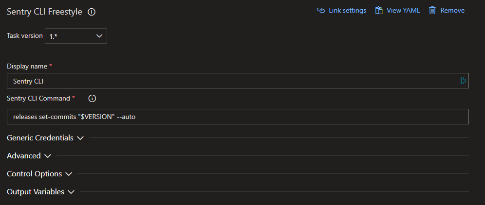

# Sentry CLI Task for Azure Pipelines

This is an Azure DevOps Extension that lets you run Sentry CLI Commands. (as [Sentry](https://marketplace.visualstudio.com/publishers/Sentry) does not provide it)
Just use it as described in [there documentation](https://docs.sentry.io/cli/).

## How to use

Add the task to your Pipeline and set the command

> Attention, at the moment you have to authenticate manually beforehand ([through auth token](https://docs.sentry.io/cli/configuration/))

It is utilizing [sentry-cli](https://github.com/getsentry/sentry-cli). You can either use predefined tasks or hack it your way with the freestyle task. 

Provide multiple Tasks:
- Create an issue to add your idea.

## License
MIT
